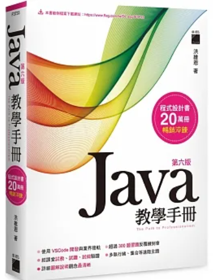

# Introduction
This repo contains my practice of Java sessions at college.
## Book
Java教學手冊第六版

## Content Structure
- [Java](Java/)
    - [Ch4](Java/Ch4)
    - [Ch5](Java/Ch5)
    - [Ch6](Java/Ch6)
    - [Ch7](Java/Ch7)
    - [Ch8](Java/Ch8)
    - [Ch9](Java/Ch9)
    - [Ch10](Java/Ch10/)
    - [Ch11](Java/Ch11/)
    - [Ch12](Java/Ch12/)
    - [Ch13](Java/Ch13/)
    - [Ch14](Java/Ch14/)
    - [Ch15](Java/Ch15/)
    - [Ch16](Java/Ch16/)
    - [Ch17](Java/Ch17/)
    - [Mid-Term Practice](Java/Mid-Term%20Practice/)